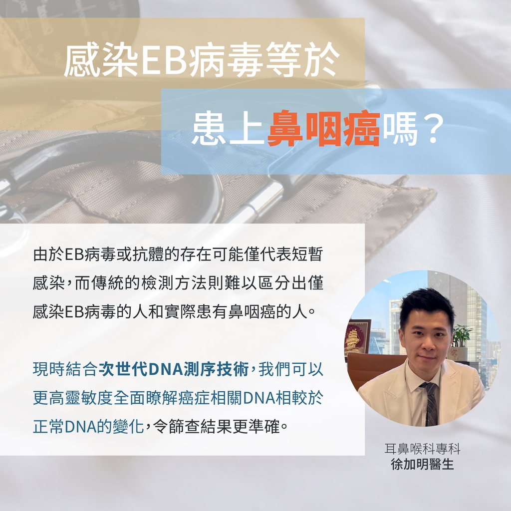

開始步入中年或成為家中支柱，大家自然對健康管理愈加重視，進行年度身體檢查便成為「例行公事」。但是不少人因體檢後，發現自己EB病毒檢查結果呈陽性，為此感到憂心忡忡，生怕患上鼻咽癌。事實是否就是這樣？我們邀請了耳鼻喉科專科徐加明醫生為大家詳細講解。

 

\---------------------------------------------------------------------

 

問：我的EB病毒抽血結果是陽性，我是否已患上鼻咽癌？抽血測試真的準確嗎？

 

答：許多人會擔心，於體檢時進行的EB病毒抽血測試結果為陽性，是否代表自己已患上，或未來會患上鼻咽癌？

 

兩種最常用的檢測方法，包括血清學檢測和以定量PCR測量血漿中的EB病毒DNA，檢測的是EB病毒的抗體或EB病毒數值。然而，EB病毒感染非常普遍，抗體或病毒的存在可能僅代表短暫感染，並不一定代表患有鼻咽癌，所以這兩種檢測方法都難以區分僅感染EB病毒的人和實際患有鼻咽癌的人。

 

此外，香港大學一項研究發現，並非所有EB病毒都有高致癌性，只有個別基因組序排列的EB病毒與鼻咽癌有較高關聯性；該項研究發現鼻咽癌腫瘤帶有其中兩種有特定基因組變異的EB病毒，而在97％鼻咽癌患者中都有發現這兩種特定EB病毒¹。因此，若能分辨到有基因變異的EB病毒，將有效找出鼻咽癌的高風險人群。

 

而現時市面上其中一項新式早期鼻咽癌篩查，應用了PCR（聚合酶連鎖反應）及次世代DNA測序技術，後者能對樣本的EBV DNA進行全基因組分析, 並能夠檢測基因變異以外的其他癌症相關變異（例如片段大小）, 以更高靈敏度全面瞭解癌症相關DNA相較於正常DNA的變化。此篩查可針對性地檢驗人類和EB病毒的DNA與鼻咽癌相關之特徵，突破以往鼻咽癌檢測方法的局限，提供更準確的篩查結果。

 

倘若不幸確診鼻咽癌，醫生將會根據癌症分期來設計治療方案，而放射治療是醫治鼻咽癌的主要方法，醫生或會因應臨床需要兼用化學治療來加強治療的成效。幸而電療和化療對於鼻咽癌的治療效果也不錯，治愈率高達90%(一、二期)、70%(三期)、和50%(四A期)，愈早發現治愈率愈高²。

 

因此，對於鼻咽癌高危群組，進行早期鼻咽癌篩查十分重要，有助患者及早發現病情並開展治療，不但可減低治療的難度和治療帶來的副作用，更能提高治癒的機會。如發現自己持續出現疑似鼻咽癌病徵，應儘快求醫，切勿拖延診斷或治療，以免病情惡化。

 

引用資料：

1 Hui, K.F., Chan, T.F., Yang, W., Shen, J.J., Lam, K.P., Kwok, H., Sham, P.C., Tsao, S.W., Kwong, D.L., Lung, M.L. and Chiang, A.K.S. (2019), High risk Epstein-Barr virus variants characterized by distinct polymorphisms in the EBER locus are strongly associated with nasopharyngeal carcinoma. Int. J. Cancer, 144: 3031-3042. https://doi.org/10.1002/ijc.32049

2 認識癌症：鼻咽癌. Hong Kong Cancer Fund, 2015. https://www.cancer-fund.org/wp-content/uploads/2017/07/%E9%BC%BB%E5%92%BD%E7%99%8C.pdf.

 

以上資料僅供參考，不能作診症用途或取代任何臨床醫療意見。如有任何疑問，請向你的醫生、或專業醫護人員查詢，切勿延誤治療。